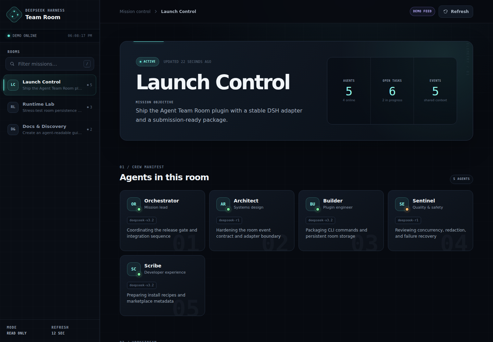
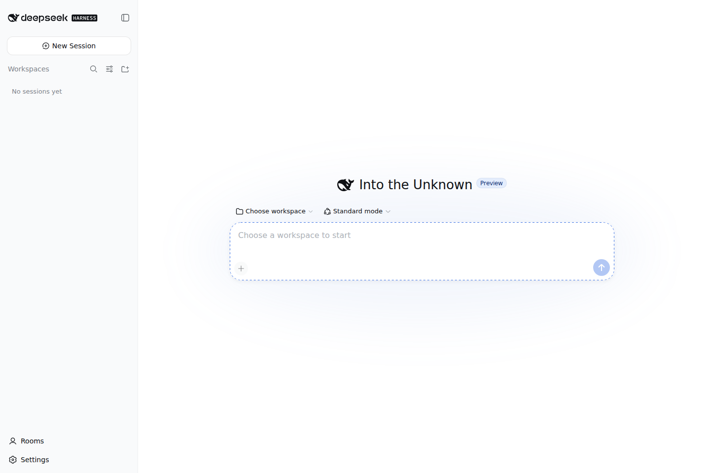
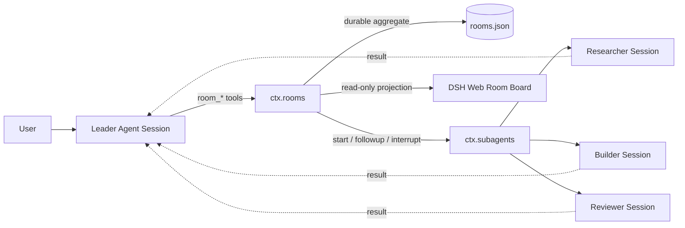

<div align="center">

# Agent Team Room

**Persistent rooms for independent agents in DeepSeek Harness.**

Create a room, invite agents with different roles or models, send direct or broadcast messages,
track work, and watch one shared timeline—without collapsing every agent into one context.

[中文](README.zh.md) · [Install](#install) · [Tool reference](#room-tools) · [Security](SECURITY.md)

</div>



<p align="center"><sub>A small native <strong>Rooms</strong> entry opens the board without replacing DSH Web.</sub></p>



## Why a room?

Subagents are excellent at delegation, but a team also needs a place to coordinate. Agent Team Room adds that missing layer:

- **Independent context** — every member is a continuable DSH child Session.
- **Persistent membership** — a room survives Harness restarts and can attach an existing direct child.
- **Clear communication** — direct messages and broadcasts use each Agent's FIFO inbox.
- **Tracked work** — assignments have durable status, results, and failure records.
- **Shared timeline** — room events form a bounded, ordered timeline; member transcripts remain separate.
- **Visible state** — a responsive DSH Web dashboard shows rooms, agents, tasks, and activity.



The Leader remains the coordinator and authorization boundary. Agents share selected room events, not hidden prompts, tool traces, or full chat history.

## Install

Requirements: Node.js `^22.19.0 || >=24`, DeepSeek Harness `0.1.0-rc.6`.

```sh
# Pin the release for reproducible installs.
dsh plugin --profile web add github:ishuowang/dsh-agent-team-room#v0.2.0

# Start the same Web profile.
dsh web
```

Open [http://127.0.0.1:3080/agent-team-room/](http://127.0.0.1:3080/agent-team-room/). The board is read-only by design; room actions go through the Agent's permission-aware tools.

On DSH Web, the same package also adds a small **Rooms** action to the native sidebar footer. It uses DSH's additive `sidebar.footer.action` slot and opens the same-origin `/agent-team-room/` board in a new tab, so the current conversation and all native controls stay mounted. It does not replace or patch the root, sidebar, or conversation UI.

To try the visual demo without creating a room, append `?demo=1`.

### First room

Ask the leader Agent:

> Create a room called Release Lab for shipping this change. Add a researcher, an implementer, and a reviewer. Assign them independent tasks, wait for all results, then close the room with a final summary.

The Agent can discover and call the Room tools on its own.

## Room tools

| Tool | Purpose |
| --- | --- |
| `room_create` | Create a durable room owned by the calling Agent. |
| `room_list` / `room_get` | List room summaries or read one complete room aggregate. |
| `room_history` | Read recent shared events without opening Agent transcripts. |
| `room_add_agent` | Create a continuable child or attach an existing direct child. |
| `room_remove_agent` | Leave the room; optionally interrupt the current turn. |
| `room_send` | Queue a direct follow-up for one member. |
| `room_broadcast` | Queue a message for every active member with per-Agent delivery results. |
| `room_assign` | Create and deliver one tracked task. |
| `room_task_get` | Read a task's current status and result. |
| `room_task_complete` | Let the assigned Agent explicitly report a correlated terminal result. |
| `room_wait` | Wait for selected tasks or a bounded timeout. |
| `room_close` | Close the room, retain history, and optionally interrupt members. |

## Configuration

The bundle defaults to the built-in continuable `spawn` provider and stores state at
`$DSH_HOME/agent-team-room/rooms.json` (or `~/.dsh/agent-team-room/rooms.json`). Override the complete row in the profile's `cordis.patch.yml`:

```yaml
- id: agent-team-room
  name: dsh-agent-team-room
  config:
    provider: spawn
    storageFile: /srv/dsh/agent-team-room/rooms.json
    maxMembersPerRoom: 24
    maxMessageChars: 20000
    maxResultChars: 40000
    maxEventsPerRoom: 10000
    maxTasksPerRoom: 2000
```

The dashboard route can also be moved:

```yaml
- id: agent-team-room-dashboard
  name: dsh-agent-team-room/dashboard
  config:
    routePrefix: /rooms
    allowRemote: false
```

The native sidebar action intentionally targets the default `/agent-team-room/` path. If `routePrefix` is changed, open or bookmark the configured dashboard URL directly.

## Design boundaries

- New members are direct, continuable children of the Leader. This preserves DSH's parent→child authorization instead of creating an ungoverned peer channel.
- The room stores coordination data only. Each Agent Session owns its private prompt, transcript, tools, and lifecycle.
- Task completion is an explicit, assignee-only `room_task_complete` report keyed by both room and task id. An unrelated FIFO message or Agent lifecycle event cannot complete a task.
- The JSON aggregate uses atomic replacement and mode `0600`; in-flight tasks are marked failed after a process restart because their terminal report could not be observed reliably. Treat one storage file as single-writer state: do not point multiple DSH processes at the same file.
- Events and tasks have configurable per-room retention ceilings to bound storage growth.
- The Web board exposes a read-only projection on the existing DSH HTTP server. It rejects non-loopback clients by default even if DSH binds to `0.0.0.0`; only set `allowRemote: true` behind an authenticated TLS reverse proxy.
- DeepSeek Harness is in developer preview. Harness-specific calls are isolated in `RoomRuntime`, and compatibility is pinned and tested against `0.1.0-rc.6`.

## Develop

```sh
npm ci
npm run check
npm pack --dry-run
```

The repository commits `lib/` intentionally, including the ModuleLoader-compatible `lib/client.js` browser bundle. A GitHub install therefore receives prebuilt JavaScript and does not need permission to run a dependency `prepare` script.

Development branches use the `feature/` prefix; see [AGENTS.md](AGENTS.md) and [CONTRIBUTING.md](CONTRIBUTING.md).

## Discovery

The repository uses the official [`dsh-plugin`](https://github.com/topics/dsh-plugin) topic, which makes it discoverable by DSH ecosystem indexes. A curated `awesome-dsh-plugin` listing is submitted separately and remains subject to community review.

## License

[MIT](LICENSE) © 2026 ishuowang
