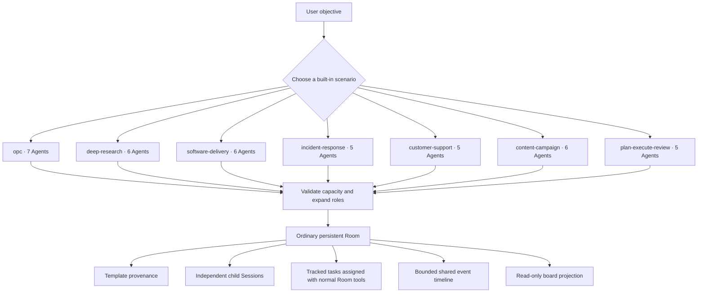
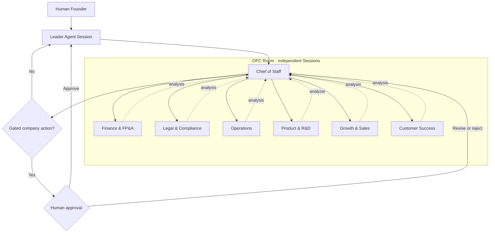

<div align="center">

# Agent Team Room

**Persistent multi-Agent rooms and seven ready-to-run team scenarios for DeepSeek Harness.**

Turn one objective into independent, continuable Agent Sessions with explicit roles, tracked work,
bounded shared events, and a Leader that remains the authorization boundary.

[中文](README.zh.md) · [Scenarios](#seven-built-in-scenarios) · [Install](#install) · [Create](#create-from-a-template) · [Surfaces](#product-surfaces) · [Tools](#tool-reference) · [Security](SECURITY.md)

</div>

## Seven built-in scenarios

Start with a built-in team shape instead of assembling every Room by hand. The count below is the number of new independent Agent Sessions started; the calling Leader is an additional Room member.

| Template id | Scenario | Starts | Team shape |
| --- | --- | ---: | --- |
| `opc` | One-Person Company | 7 | Chief of Staff; Finance & FP&A; Legal & Compliance; Operations; Product & R&D; Growth & Sales; Customer Success. |
| `deep-research` | Deep Research | 6 | Research Lead; two independent researchers; Source Critic; Analyst; Report Writer. |
| `software-delivery` | Software Delivery | 6 | Delivery Lead; Repo Explorer; Implementer; Test & QA; Reviewer; Security & SRE. |
| `incident-response` | Incident Response | 5 | Incident Commander; Diagnostics; Infrastructure & SRE; Security; Communications & Scribe. |
| `customer-support` | Customer Support | 5 | Support Triage; Account & Orders; Billing & Refunds; Technical Support; Policy & Escalation. |
| `content-campaign` | Content Campaign | 6 | Campaign Lead; Audience Researcher; Content Strategist; Copywriter; Channel Adapter; Editor & Compliance. |
| `plan-execute-review` | Plan · Execute · Review | 5 | Planner; two independent Executors; Critic; Synthesizer. |

Templates are declarative starting plans. They create an ordinary persistent Room and start the listed roles; they do not merge Agent contexts or grant new permissions.

`opc` is marked experimental in v0.3.0. The other six templates are standard built-ins.

This is a practical starter set, not a popularity ranking. It follows recurring official multi-Agent patterns: manager/parallel/review loops and specialist handoffs in the [OpenAI Agents SDK](https://openai.github.io/openai-agents-python/multi_agent/), sequential/concurrent/handoff/group-chat/manager orchestration in [Microsoft Agent Framework](https://learn.microsoft.com/en-us/agent-framework/workflows/orchestrations/), and the emerging human-led OPC model described by the [World Economic Forum](https://www.weforum.org/stories/artificial-intelligence/agentic-ai-reshaping-what-it-means-to-be-a-founder/).

## Install

Requirements: Node.js `^22.19.0 || >=24`, DeepSeek Harness `0.1.0-rc.6`.

```sh
# Pin the release for reproducible installs.
dsh plugin --profile web add github:ishuowang/dsh-agent-team-room#v0.3.0

# Start the same Web profile.
dsh web
```

The Host service, model-facing tools, native `/room-template` command, additive Web entry, and read-only board ship in one plugin package.

## Create from a template

### Native DSH Web picker

In a materialized DSH Web Session, enter the bare command:

```text
/room-template
```

The plugin decorates that command with DSH Web's native `popupSelect`. It lists the seven real templates and shows how many independent Agents each choice starts. Before **Create room** becomes the intentional next step, the popup asks you to acknowledge that multiple Agents will start and may consume model quota.

The picker deliberately has no custom form. It creates the selected template with its defaults. Use the explicit command when you need a custom Room name, objective, provider, or model.

If the Web decoration is unavailable, the Host command remains functional; bare `/room-template` behaves like `list`.

### Native command / CLI surface

```text
# Discover and inspect without starting Agents.
/room-template list
/room-template show software-delivery

# Create with the template defaults.
/room-template create software-delivery

# Override the Room identity.
/room-template create software-delivery \
  --name "Release Crew" \
  --objective "Ship v0.3.0 with tests, review, and release notes"
```

The same command accepts `--provider <id>`, `--model-provider <id>`, and `--model <id>`; each override applies to every new template member.

An explicit `create` command starts provisioning immediately and does not display the Web popup confirmation. Inspect the template and its Agent count first. If provisioning fails after some child Sessions have started, the partial Room is closed and retained for inspection; already-created Sessions are not silently deleted.

The same capability is available to an Agent through `room_template_list` and `room_create_from_template`.

## How every scenario becomes a Room

The template registry changes how a team is started, not how a Room behaves afterward:



In v0.3.0, expansion creates the Room and role Sessions. It does not pre-create tracked tasks; the Leader assigns concrete work with the ordinary Room tools after the objective is known.

## OPC: one company, explicit human decisions

The `opc` template starts seven specialist Sessions around the calling Leader. Its operating model keeps the human owner above consequential company decisions:



OPC's declared approval gates are an orchestration policy carried by the template, not a new Host-level authorization primitive. Its Agents must stop and request the human Founder's approval before:

- spending, transfers, pricing commitments, or any financial transaction;
- contracts, filings, compliance representations, or decisions requiring licensed legal or tax advice;
- production releases, data deletion, external outreach, or public statements.

Agents must also surface uncertainty instead of presenting themselves as corporate officers or licensed professionals. These operational gates are separate from the Web popup's one-time confirmation that seven Agent Sessions will start.

## Why a Room?

- **Independent context** — every member is a continuable DSH child Session, not a persona inside one shared prompt.
- **Persistent coordination** — the Room record, membership, tasks, results, and bounded events survive Harness restarts.
- **Clear delivery** — direct messages, broadcasts, and assignments use each Agent's FIFO inbox without redirecting a turn already in progress.
- **Explicit completion** — only the assignee can finish its correlated Room task through `room_task_complete`.
- **Leader-owned authorization** — templates and manual tools use the same parent→child ownership checks.
- **Visible state** — a same-origin standalone board provides a read-only projection without replacing DSH Web.

## Product surfaces

### Native additive entry

The package registers one small **Rooms** action in DSH Web's official `sidebar.footer.action` slot. It opens the board in a new tab; the active conversation, composer, sidebar, and all native controls remain mounted.

<p align="center">
  
  <br>
  <sub>Real DSH Web capture. Agent Team Room adds only the Rooms footer action; it does not patch the DOM or replace a root surface.</sub>
</p>

### Same-origin standalone board

The board is served by the existing DSH HTTP Host at `/agent-team-room/`. It shows Room inventory, members, tracked work, and shared events as a read-only projection; mutations remain in permission-aware Agent tools and commands.


<p align="center"><sub>Real board rendered with <code>?demo=1</code>; all names and work data are synthetic. This crop shows Room summaries and members; task and event sections continue below.</sub></p>

The route is loopback-only by default. The dark board and the native DSH screenshot above are intentionally separate surfaces connected by the additive link, not two competing replacements for the conversation UI.

## Tool reference

### Template tools

| Tool | Purpose |
| --- | --- |
| `room_template_list` | List built-in template ids, roles, orchestration shape, experimental marker, and declared approval gates without creating anything. |
| `room_create_from_template` | Create an ordinary persistent Room and start every template role as an independent continuable child Session. Supports Room/provider/model overrides. |

### Room tools

| Tool | Purpose |
| --- | --- |
| `room_create` | Create a persistent Room owned by the calling Agent. |
| `room_list` / `room_get` | List Room summaries or read one complete Room aggregate. |
| `room_history` | Read recent shared events without opening Agent transcripts. |
| `room_add_agent` | Create a continuable child or attach an existing direct child. |
| `room_remove_agent` | Remove a member and optionally interrupt its current turn. |
| `room_send` | Queue a direct follow-up for one member. |
| `room_broadcast` | Queue one message for every active member with per-Agent delivery results. |
| `room_assign` | Create and deliver one tracked task. |
| `room_task_get` | Read a task's current status and result. |
| `room_task_complete` | Let the assignee explicitly report a correlated terminal result. |
| `room_wait` | Wait for selected tasks or a bounded timeout. |
| `room_close` | Close the Room, retain history, and optionally interrupt members. |

## Configuration

The bundle defaults to DSH's built-in continuable `spawn` provider and stores state at `$DSH_HOME/agent-team-room/rooms.json` (or `~/.dsh/agent-team-room/rooms.json`). Override the complete row in the profile's `cordis.patch.yml`:

```yaml
- id: agent-team-room
  name: dsh-agent-team-room
  config:
    provider: spawn
    storageFile: /srv/dsh/agent-team-room/rooms.json
    maxMembersPerRoom: 24
    maxMessageChars: 20000
    maxResultChars: 40000
    maxEventsPerRoom: 10000
    maxTasksPerRoom: 2000
```

OPC requires capacity for the Leader plus seven new members. Every template validates required capacity before creating its Room.

The dashboard route can also be moved:

```yaml
- id: agent-team-room-dashboard
  name: dsh-agent-team-room/dashboard
  config:
    routePrefix: /rooms
    allowRemote: false
```

The native sidebar action intentionally targets the default `/agent-team-room/` path. If `routePrefix` changes, open or bookmark the configured board URL directly.

## Design and safety boundaries

- A template expands into the existing Room/member machinery and persists only optional template provenance. It does not introduce a parallel runtime or widen authorization.
- New members remain direct, continuable children of the Leader. A template cannot open an arbitrary peer channel.
- Agent Sessions keep private prompts, full transcripts, tools, and lifecycles. The Room stores selected coordination records; no template creates shared hidden context.
- Starting a scenario can launch five to seven model-backed Agents. The Web picker requires a launch acknowledgement, while direct command and tool callers must manage cost intentionally.
- Every template declares domain-specific human approval gates. They are workflow instructions surfaced by `room_template_list`, not Host permission enforcement.
- OPC human approval gates are workflow instructions, not substitutes for DSH permissions, provider controls, legal review, or financial authorization. A human must make the decision.
- Capacity is checked before the first Room write. If a later role fails to start, the partial Room is closed and retained; already-created Sessions stay traceable instead of being falsely reported as rolled back.
- Task completion remains an explicit, assignee-only `room_task_complete` report keyed by Room id and Task id.
- The JSON aggregate uses atomic replacement and mode `0600`. In-flight tasks are marked failed after a process restart; one file must have only one DSH writer.
- Events and tasks have configurable per-Room retention ceilings.
- The board rejects non-loopback clients by default even if DSH binds to `0.0.0.0`; enable remote access only behind authenticated TLS.
- DeepSeek Harness remains in developer preview. Harness-specific calls are isolated in `RoomRuntime`, and compatibility is pinned and tested against `0.1.0-rc.6`.

## Develop

```sh
npm ci
npm run check
npm pack --dry-run
```

The repository intentionally commits `lib/`, including the ModuleLoader-compatible browser bundle. A GitHub install receives prebuilt JavaScript and does not need permission to run a dependency `prepare` script.

Development branches use the `feature/` prefix; see [AGENTS.md](AGENTS.md) and [CONTRIBUTING.md](CONTRIBUTING.md).

## Discovery

The repository uses the official [`dsh-plugin`](https://github.com/topics/dsh-plugin) topic for ecosystem discovery. Curated `awesome-dsh-plugin` inclusion is submitted separately and remains subject to community review.

## License

[MIT](LICENSE) © 2026 ishuowang
