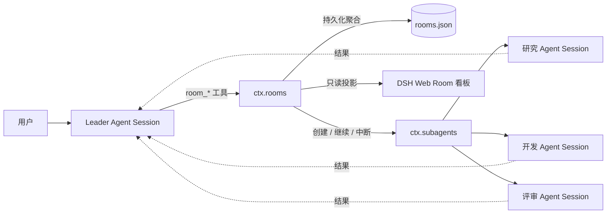

<div align="center">

# Agent Team Room

**为 DeepSeek Harness 提供持久化的多 Agent 协作房间。**

创建房间、加入不同角色或模型的 Agent、定向或广播消息、跟踪任务，并在一条共享时间线上查看进展——同时保持每个 Agent 的上下文彼此独立。

[English](README.md) · [安装](#安装) · [工具一览](#room-工具) · [安全说明](SECURITY.md)

</div>


## 为什么需要 Room？

Subagent 解决了“把工作委派出去”，Room 则补齐“团队如何持续协作”：

- **独立上下文**：每个成员都是可继续对话的 DSH 子 Session。
- **持久成员关系**：Harness 重启后房间仍然存在，也能加入已有直属子 Agent。
- **明确消息通道**：定向与广播消息进入各 Agent 自己的 FIFO 收件箱。
- **可追踪任务**：任务分配、结果与失败状态都会持久保存。
- **共享时间线**：房间事件按顺序保留在有上限的窗口中；成员的完整会话不会混在一起。
- **可视化状态**：DSH Web 看板展示房间、成员、任务与活动记录。



Leader 始终是协调者和权限边界。Agent 只共享必要的 Room 事件，不共享隐藏提示词、工具轨迹或完整聊天历史。

## 安装

环境要求：Node.js `^22.19.0 || >=24`、DeepSeek Harness `0.1.0-rc.6`。

```sh
# 固定 Release，获得可复现安装。
dsh plugin --profile web add github:ishuowang/dsh-agent-team-room#v0.1.0

# 启动同一个 Web profile。
dsh web
```

打开 [http://127.0.0.1:3080/agent-team-room/](http://127.0.0.1:3080/agent-team-room/)。看板有意保持只读；实际操作仍通过具备 DSH 权限上下文的 Agent 工具完成。

还没有创建房间时，可以访问 `?demo=1` 查看视觉演示。

### 创建第一个房间

直接告诉 Leader Agent：

> 创建一个叫 Release Lab 的房间，用于发布当前改动。加入研究、开发和评审三个 Agent，分别分配独立任务，等待全部完成后汇总结果并关闭房间。

Agent 会自行发现并调用 Room 工具。

## Room 工具

| 工具 | 用途 |
| --- | --- |
| `room_create` | 创建由当前 Agent 管理的持久房间。 |
| `room_list` / `room_get` | 查看房间摘要或完整 Room 聚合。 |
| `room_history` | 读取共享事件，不加载成员的完整会话。 |
| `room_add_agent` | 新建可持续子 Agent，或加入已有直属子 Agent。 |
| `room_remove_agent` | 移出成员，并可中断其当前轮次。 |
| `room_send` | 给一个成员排入定向消息。 |
| `room_broadcast` | 给全部成员广播，并逐个返回投递结果。 |
| `room_assign` | 创建并投递一个可追踪任务。 |
| `room_task_get` | 读取任务状态和结果。 |
| `room_task_complete` | 由任务执行 Agent 显式回报与 Room/Task 关联的终态。 |
| `room_wait` | 在限定时间内等待指定任务。 |
| `room_close` | 关闭房间、保留历史，并可中断成员。 |

## 配置

默认使用 DSH 内置的 continuable `spawn` provider，状态保存到 `$DSH_HOME/agent-team-room/rooms.json`（未设置时为 `~/.dsh/agent-team-room/rooms.json`）。可在 profile 的 `cordis.patch.yml` 中完整覆盖这一行：

```yaml
- id: agent-team-room
  name: dsh-agent-team-room
  config:
    provider: spawn
    storageFile: /srv/dsh/agent-team-room/rooms.json
    maxMembersPerRoom: 24
    maxMessageChars: 20000
    maxResultChars: 40000
    maxEventsPerRoom: 10000
    maxTasksPerRoom: 2000
```

也可以调整看板地址：

```yaml
- id: agent-team-room-dashboard
  name: dsh-agent-team-room/dashboard
  config:
    routePrefix: /rooms
    allowRemote: false
```

## 设计边界

- 新成员是 Leader 的直属 continuable child，遵循 DSH 的父→子授权规则，不创建无约束的任意 peer 通道。
- Room 只保存协作信息；提示词、完整历史、工具和生命周期仍归各 Agent Session 所有。
- 任务只能由被分配的 Agent 通过 `room_task_complete` 显式回报，并同时校验 Room id 与 Task id。普通 FIFO 消息或其他 Agent 轮次不会误完成任务。
- JSON 聚合采用原子替换并使用 `0600` 权限。进程重启时，未收到终态回报的在途任务会标记为失败。一个存储文件应只由一个 DSH 进程写入。
- 事件与任务都有可配置的单房间保留上限，避免状态无界增长。
- 看板复用 DSH HTTP Server，只提供只读投影。即使 DSH 绑定 `0.0.0.0`，默认也会拒绝非 loopback 客户端；只有在带认证和 TLS 的反向代理后才应设置 `allowRemote: true`。
- DeepSeek Harness 仍处于开发者预览阶段。本项目把 Harness 调用收敛在 `RoomRuntime` 中，并固定针对 `0.1.0-rc.6` 测试。

## 开发

```sh
npm ci
npm run check
npm pack --dry-run
```

仓库有意提交预构建的 `lib/`。从 GitHub 安装时无需授权依赖执行 `prepare` 脚本。

开发分支统一使用 `feature/` 前缀，详见 [AGENTS.md](AGENTS.md) 与 [CONTRIBUTING.md](CONTRIBUTING.md)。

## 插件发现与上架

仓库添加官方 [`dsh-plugin`](https://github.com/topics/dsh-plugin) topic 后，即可被 DSH 生态索引发现。`awesome-dsh-plugin` 精选目录会通过单独 PR 申请，最终是否合入由社区评审决定。

## License

[MIT](LICENSE) © 2026 ishuowang
