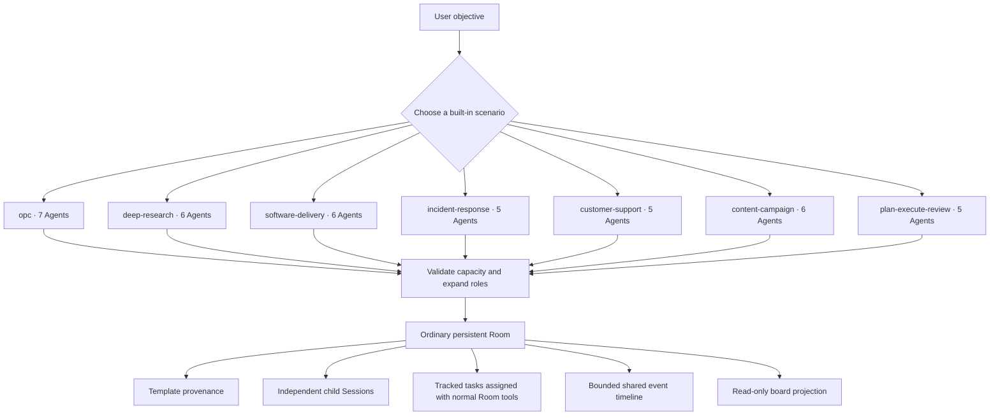
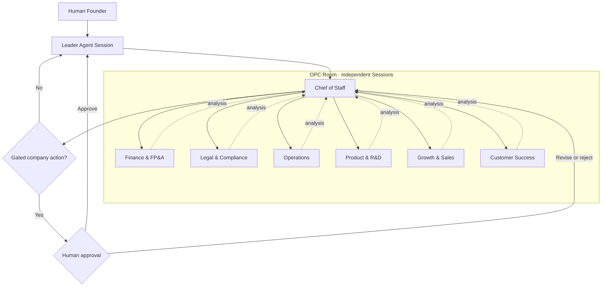

<div align="center">

# Agent Team Room

**为 DeepSeek Harness 提供持久化多 Agent 房间，以及七种开箱即用的团队场景。**

把一个目标展开为上下文独立、可继续对话的 Agent Session；每个成员拥有明确角色，工作可追踪，
共享事件有边界，Leader 始终掌握授权。

[English](README.md) · [场景模板](#七种内置场景) · [安装](#安装) · [创建](#从模板创建) · [产品界面](#产品界面) · [工具](#工具参考) · [安全说明](SECURITY.md)

</div>

## 七种内置场景

从经过定义的团队结构开始，而不必每次手工组装 Room。下表数量表示新启动的独立 Agent Session 数；调用模板的 Leader 是额外的 Room 成员。

| 模板 id | 场景 | 启动数 | 团队结构 |
| --- | --- | ---: | --- |
| `opc` | One-Person Company（一人公司） | 7 | Chief of Staff、Finance & FP&A、Legal & Compliance、Operations、Product & R&D、Growth & Sales、Customer Success。 |
| `deep-research` | Deep Research（深度研究） | 6 | Research Lead、两名独立 Researcher、Source Critic、Analyst、Report Writer。 |
| `software-delivery` | Software Delivery（软件交付） | 6 | Delivery Lead、Repo Explorer、Implementer、Test & QA、Reviewer、Security & SRE。 |
| `incident-response` | Incident Response（事故响应） | 5 | Incident Commander、Diagnostics、Infrastructure & SRE、Security、Communications & Scribe。 |
| `customer-support` | Customer Support（客户支持） | 5 | Support Triage、Account & Orders、Billing & Refunds、Technical Support、Policy & Escalation。 |
| `content-campaign` | Content Campaign（内容营销） | 6 | Campaign Lead、Audience Researcher、Content Strategist、Copywriter、Channel Adapter、Editor & Compliance。 |
| `plan-execute-review` | Plan · Execute · Review（计划·执行·评审） | 5 | Planner、两名独立 Executor、Critic、Synthesizer。 |

模板是声明式启动计划。它会创建一个普通的持久 Room 并启动列出的角色；不会合并 Agent 上下文，也不会授予新权限。

`opc` 在 v0.3.0 中标记为 experimental；其余六种模板是标准内置模板。

这是一组实用首发模板，不是“热度排行榜”。选型来自多个官方资料中反复出现的协作模式：[OpenAI Agents SDK](https://openai.github.io/openai-agents-python/multi_agent/) 的 manager、并行、评审循环与专员 handoff，[Microsoft Agent Framework](https://learn.microsoft.com/en-us/agent-framework/workflows/orchestrations/) 的 sequential、concurrent、handoff、group chat 与 manager 编排，以及 [World Economic Forum](https://www.weforum.org/stories/artificial-intelligence/agentic-ai-reshaping-what-it-means-to-be-a-founder/) 讨论的人类主导 OPC 模式。

## 安装

环境要求：Node.js `^22.19.0 || >=24`、DeepSeek Harness `0.1.0-rc.6`。

```sh
# 固定 Release，保证安装可复现。
dsh plugin --profile web add github:ishuowang/dsh-agent-team-room#v0.3.0

# 启动同一个 Web profile。
dsh web
```

Host 服务、模型工具、原生 `/room-template` 命令、additive Web 入口和只读看板都包含在同一个插件包中。

## 从模板创建

### DSH Web 原生选择器

在已经 materialize 的 DSH Web Session 中输入裸命令：

```text
/room-template
```

插件会使用 DSH Web 原生 `popupSelect` 装饰该命令。选择器列出七种真实模板，并显示每个选项会启动多少个独立 Agent。在执行 **Create room** 之前，弹窗要求你确认：多个 Agent 将立即启动，并可能消耗模型额度。

选择器有意不提供自定义表单，只会使用模板默认值创建 Room。需要覆盖 Room 名称、目标、provider 或模型时，请使用显式命令。

即使 Web 装饰不可用，Host 命令仍然有效；裸 `/room-template` 的行为等同于 `list`。

### 原生命令 / CLI 界面

```text
# 仅发现和检查模板，不启动 Agent。
/room-template list
/room-template show software-delivery

# 使用模板默认值创建。
/room-template create software-delivery

# 覆盖 Room 标识。
/room-template create software-delivery \
  --name "Release Crew" \
  --objective "完成 v0.3.0 的测试、评审与发布说明"
```

同一命令还接受 `--provider <id>`、`--model-provider <id>` 和 `--model <id>`；每个覆盖值都会应用到所有新模板成员。

显式 `create` 命令会立即开始创建，不显示 Web popup 确认框。请先检查模板和 Agent 数量。如果部分子 Session 已启动后才发生创建失败，插件会关闭并保留这个不完整 Room 供检查；不会悄悄删除已经创建的 Session。

Agent 也能通过 `room_template_list` 和 `room_create_from_template` 使用相同能力。

## 所有场景如何变成 Room

模板注册表只改变团队的启动方式；创建完成后，Room 的运行方式完全相同：



在 v0.3.0 中，模板展开只创建 Room 和各角色 Session，不会预先创建 tracked task。目标明确后，Leader 再通过普通 Room 工具分配具体工作。

## OPC：一家公司，关键决策由人确认

`opc` 模板会围绕调用方 Leader 启动七个专业 Session。它把人类所有者放在重要公司决策之上：



OPC 声明的 approval gate 是模板携带的编排策略，不是新的 Host 级授权机制。Agent 必须暂停并请求人类 Founder 批准：

- 支出、转账、价格承诺或任何财务交易；
- 合同、申报、合规陈述，或需要持牌法律/税务建议的决策；
- 生产发布、数据删除、外部联络或公开声明。

Agent 还必须主动暴露不确定性，不能把自己描述成公司管理人员或持牌专业人士。这些业务运行审批与 Web popup 中“一次性确认将启动七个 Agent Session”是两件不同的事。

## 为什么需要 Room？

- **上下文独立**：每个成员都是可继续对话的 DSH 子 Session，而不是同一个共享提示词中的不同人设。
- **协作状态持久化**：Room 记录、成员关系、任务、结果和有界事件可以跨 Harness 重启保留。
- **投递方式明确**：定向消息、广播和任务进入各 Agent 自己的 FIFO 收件箱，不会改变正在执行的轮次。
- **完成状态显式关联**：只有 assignee 能通过 `room_task_complete` 完成与自己关联的 Room 任务。
- **Leader 持有授权**：模板和手工工具使用相同的父→子所有权校验。
- **状态可见**：同源的独立看板提供只读投影，不替换 DSH Web。

## 产品界面

### 原生 additive 入口

插件只在 DSH Web 官方 `sidebar.footer.action` slot 中注册一个轻量 **Rooms** 入口。它在新标签页打开看板；当前会话、输入框、侧边栏和全部原生控件会继续保留。

<p align="center">
  
  <br>
  <sub>真实 DSH Web 截图。Agent Team Room 只增加 Rooms 底部入口，不修改 DOM，也不替换 root surface。</sub>
</p>

### 同源独立只读看板

看板由现有 DSH HTTP Host 在 `/agent-team-room/` 提供服务。它以只读方式展示 Room 列表、成员、tracked work 和共享事件；所有写操作仍由带权限上下文的 Agent 工具和命令完成。


<p align="center"><sub>真实看板通过 <code>?demo=1</code> 渲染，全部名称与工作数据都是合成内容。当前截图展示 Room 摘要和成员，任务与事件区域位于下方。</sub></p>

该路由默认只允许 loopback 访问。上方的深色看板和白色原生 DSH 截图是通过 additive 链接连接的两个独立 surface，并不是两套互相竞争的会话 UI 替代品。

## 工具参考

### 模板工具

| 工具 | 用途 |
| --- | --- |
| `room_template_list` | 列出内置模板 id、角色、编排结构、实验标记和声明的 approval gate，不创建任何资源。 |
| `room_create_from_template` | 创建普通持久 Room，并把每个模板角色启动为独立、可继续对话的子 Session；支持 Room/provider/model 覆盖。 |

### Room 工具

| 工具 | 用途 |
| --- | --- |
| `room_create` | 创建由当前 Agent 管理的持久 Room。 |
| `room_list` / `room_get` | 查看 Room 摘要或完整 Room 聚合。 |
| `room_history` | 读取最近共享事件，不加载成员的完整会话。 |
| `room_add_agent` | 新建可继续对话的子 Agent，或加入已有直属子 Agent。 |
| `room_remove_agent` | 移出成员，并可中断其当前轮次。 |
| `room_send` | 给一个成员排入定向 follow-up。 |
| `room_broadcast` | 给全部活跃成员排入同一消息，并逐个返回投递结果。 |
| `room_assign` | 创建并投递一个 tracked task。 |
| `room_task_get` | 读取任务当前状态和结果。 |
| `room_task_complete` | 由 assignee 显式报告与任务关联的终态。 |
| `room_wait` | 在限定时间内等待指定任务。 |
| `room_close` | 关闭 Room、保留历史，并可中断成员。 |

## 配置

bundle 默认使用 DSH 内置的 continuable `spawn` provider，状态保存到 `$DSH_HOME/agent-team-room/rooms.json`（未设置时为 `~/.dsh/agent-team-room/rooms.json`）。可在 profile 的 `cordis.patch.yml` 中完整覆盖这一行：

```yaml
- id: agent-team-room
  name: dsh-agent-team-room
  config:
    provider: spawn
    storageFile: /srv/dsh/agent-team-room/rooms.json
    maxMembersPerRoom: 24
    maxMessageChars: 20000
    maxResultChars: 40000
    maxEventsPerRoom: 10000
    maxTasksPerRoom: 2000
```

OPC 需要容纳 Leader 和七个新成员。每个模板都会在创建 Room 前校验所需容量。

也可以调整看板地址：

```yaml
- id: agent-team-room-dashboard
  name: dsh-agent-team-room/dashboard
  config:
    routePrefix: /rooms
    allowRemote: false
```

原生侧边栏入口固定指向默认 `/agent-team-room/` 路径。如果修改 `routePrefix`，请直接打开或收藏配置后的看板地址。

## 设计与安全边界

- 模板会展开到既有 Room/member 机制中，只额外保存可选模板来源信息；它不会引入平行运行时，也不会扩大授权。
- 新成员始终是 Leader 的直属 continuable child；模板不能建立任意 peer 通道。
- Agent Session 各自拥有私有提示词、完整记录、工具和生命周期。Room 只保存选定的协作记录；模板不会创建共享隐藏上下文。
- 启动一个场景可能同时创建五到七个模型 Agent。Web 选择器要求确认启动；直接命令和工具调用方则必须自行控制成本。
- 每个模板都声明了与领域对应的人工 approval gate。它们是由 `room_template_list` 展示的工作流指令，而不是 Host 权限强制机制。
- OPC 的人工 approval gate 是工作流指令，不能替代 DSH 权限、provider 控制、法律审查或财务授权；最终决定必须由人作出。
- 首次写入前会校验容量。如果后续某个角色启动失败，插件会关闭并保留不完整 Room；已经创建的 Session 继续可追踪，而不会被虚假标记为已回滚。
- 任务完成仍必须由 assignee 通过 `room_task_complete` 显式报告，并同时关联 Room id 和 Task id。
- JSON 聚合采用原子替换和 `0600` 权限。进程重启后在途任务会标记为失败；一个文件只能有一个 DSH 写入进程。
- 事件和任务都具有可配置的单 Room 保留上限。
- 即使 DSH 绑定 `0.0.0.0`，看板默认也拒绝非 loopback 客户端；只有在带认证的 TLS 代理后才应开放远程访问。
- DeepSeek Harness 仍处于开发者预览阶段。项目把 Harness 调用收敛在 `RoomRuntime` 中，并固定针对 `0.1.0-rc.6` 测试。

## 开发

```sh
npm ci
npm run check
npm pack --dry-run
```

仓库有意提交 `lib/`，其中包括兼容 ModuleLoader 的浏览器 bundle。从 GitHub 安装时会直接获得预构建 JavaScript，无需允许依赖执行 `prepare` 脚本。

开发分支统一使用 `feature/` 前缀，详见 [AGENTS.md](AGENTS.md) 与 [CONTRIBUTING.md](CONTRIBUTING.md)。

## 插件发现与上架

仓库使用官方 [`dsh-plugin`](https://github.com/topics/dsh-plugin) topic 供生态发现。`awesome-dsh-plugin` 精选目录会单独提交申请，最终是否收录由社区评审决定。

## 许可证

[MIT](LICENSE) © 2026 ishuowang
